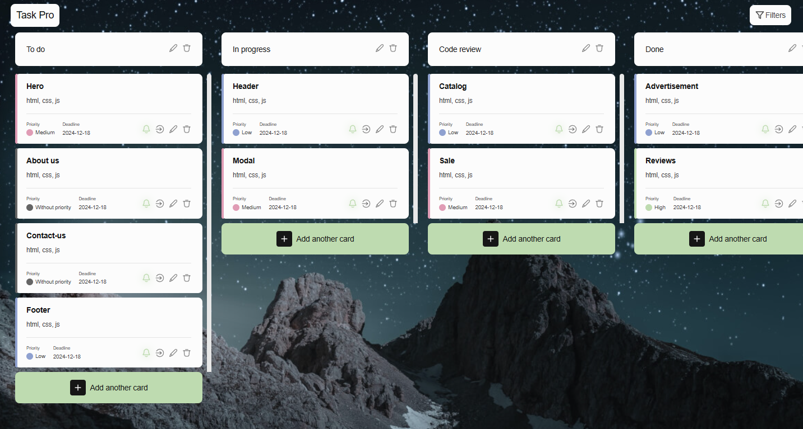

# Team project: task pro

## Description

Task Pro is a web-based task planning application that helps users organize their work and manage time effectively. Thanks to the modern interface, dynamic task management and integration with Google authorization, users can create task boards, customize columns, add task cards with priorities and deadlines, and receive reminders about deadlines.

## Features

### 1. Interface:

- Intuitive design for quick access to all functions.
- Ability to change the interface theme that is remembered the next time you log in.
- Google authorization implementation for easy login.

### 2. Personalization:

- Users can customize the look of the boards: choosing a name, icon and background for each board.
- Easy access to all functions through the navigation bar.

### 3. Dynamic task management:

- Boards allow you to create columns for tasks, customize their naming.
- In the columns, you can create cards, set priorities, description, deadlines and receive notifications about deadlines.
- Cards can be dragged between columns using drag-and-drop (implemented through the **react-beautiful-dnd** library).

### 4. Filtering tasks:

- Ability to filter cards by priority (using Redux to save filtering status).
- Easy sorting of tasks by deadlines and priority.

### 5. Reminder of deadlines:

- Task cards can have a deadline date, and with the help of notifications, users receive reminders before approaching the deadline.

### 6. Quick feedback:

- Built-in feedback form, where users can leave their questions or suggestions, indicating mail and messages.

## Stages of implementation

### 1. Interface design:

- Development of layouts for the main pages: navigation panel, page with boards, creation and editing of task cards, profile and theme settings.
- Using **Figma** to create interface prototypes.

### 2. Development of functionality:

- Implementation of logic of creation, editing and removal of boards, columns and cards with saving in Redux-state.
- Integrate Google authorization and implement theme saving via **redux-persist**.
- Using **axios** to interact with the backend and **Formik** and **Yup** to validate forms.

### 3. Dynamic interaction:

- Use **react-beautiful-dnd** to drag task cards between columns.
- Built-in notifications using **react-toastify**.

### 4. Testing and optimization:

- Perform functional testing on different devices and browsers.
- Use **Postman** to test the API and ensure the correct operation of the service.

### 5. Launch and support:

- Deploying a project on **Vercel**.
- Regular updates based on user feedback and testing of new features.

---

## Advantages of using

- **Task Management:** Create tasks, assign them to priorities and deadlines, and get reminders.
- **Flexibility:** Easily customize boards and speakers to display your workflow.
- **Personalization:** Choose an interface theme and customize the boards to your needs.
- **Intuitive design:** Simple and intuitive interface with dynamic task management.

---

## Technologies used

### 1. Programming languages:

- **JavaScript** — for writing interaction logic and data processing.

### 2. Frameworks and Libraries:

- **React.js** — for building an interface and working with components.
- **Redux.js** — to control the global state (creation of boards, columns, cards, filtering).
- **React Router** — to navigate pages without reloading.
- **Formik** and **Yup** — for form validation.
- **react-beautiful-dnd** — for drag-and-drop interaction with task cards.
- **react-toastify** — for notifications.

### 3. Tools for testing and development:

- **Postman** — for API testing.
- **GitHub** — for version control and project deployment.

### 4. Other technologies:

- **axios** — for working with API.
- **dayjs** — for working with dates and times.
- **react-datepicker** — to select dates.

---

## Additional features

- **Change Theme:** Users can switch between topics for comfortable work in different lighting conditions.
- **Google Authorization:** Easy access to the system through a Google account.
- **Quick addition of tasks:** Built-in form for quick creation of tasks without unnecessary steps.

---

**Task Pro** is a well-designed and powerful tool for managing tasks, with rich functionality for organizing workflows. Thanks to flexible settings and personalization, it is suitable for users of different levels, from individual users to large teams. The ability to adapt to different devices, as well as integration with Google authorization makes the application accessible and convenient to use. Given the future opportunities for expansion and improvement, Task Pro has great potential for further development and popularization among a wide audience.
